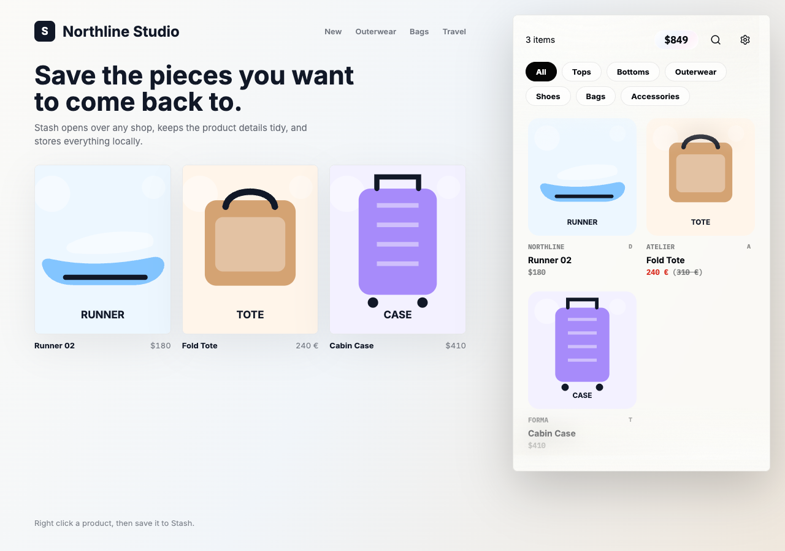

# Stash

Stash is a plain Manifest V3 Chrome/Arc extension for saving products from any shop into a compact local stash.



## What it does

- Saves products from right-clicked product cards, images, links, and product pages.
- Extracts product data from schema.org JSON-LD, embedded app JSON, Shopify product JSON, OpenGraph, microdata, and DOM context.
- Stores the stash locally in `chrome.storage.local`.
- Opens as a compact in-page panel with category filters, search, settings, and source favicons.
- Keeps visible product cards clean: short commercial model name, brand, image, source URL, and original site price.
- Supports sale display with current price and compare-at price.
- Converts totals with cached RUB fallback rates while preserving the original site currency on cards.

## Install locally

1. Open `chrome://extensions` in Chrome or Arc.
2. Enable Developer mode.
3. Choose **Load unpacked**.
4. Select the `extension` folder from this repo.
5. Click the Stash extension icon to open the in-page panel.
6. Open a product page or product grid, right click an item/image/card, then choose **Save to Stash**.

## Privacy

Stash has no backend, accounts, telemetry, or hidden collection. Saved items stay in local browser storage.

The extension requests broad `http://*/*` and `https://*/*` host access because it is designed to save products from arbitrary shops. New network requests must be documented and must never execute remote code.

Current network behavior is limited to user-triggered save/open flows:

- Product-page enrichment can fetch the same-origin product page when the clicked card is missing title, image, or price.
- Shopify enrichment can fetch a matching same-origin `/products/<handle>.js` endpoint.
- Currency totals can fetch RUB exchange rates from `https://open.er-api.com/v6/latest/<currency>` and cache the numeric rate locally.

Stash does not call a remote favicon proxy. Source icons fall back to local text glyphs.

## Project structure

```text
extension/
  manifest.json
  background.js
  content/
    bootstrap.js
    constants.js
    extractors/
    panel/
    pricing/
    styles/
    storage.js
    text.js
    utils.js
```

Content scripts are ordered classic MV3 scripts. If a content file is added, removed, renamed, or reordered, update both `extension/manifest.json` and `CONTENT_SCRIPT_FILES` in `extension/background.js`.

## Development

This repo intentionally has no build step.

- Prefer small, visible changes.
- Keep new source modules under 400 lines.
- Keep `extension/content/constants.js` first and `extension/content/bootstrap.js` last in the content-script order.
- When changing content-script behavior, bump `CONTENT_VERSION` in `extension/content/constants.js`.
- When changing extension behavior or assets, bump the patch version in `extension/manifest.json`.
- Keep storage keys namespaced under `stash.*`; schema changes need explicit versioning or migration.
- Run the cheapest relevant check after edits, usually `node --check` for changed JS files.

Useful checks:

```bash
find extension/content -type f -name '*.js' -print | sort | xargs node --check
node --check extension/background.js
```

## Status

Stash is early MVP software. It currently focuses on local saving, generic extraction, and a polished in-page panel. It does not include sync, accounts, price tracking, store-specific adapters, or Chrome Web Store packaging automation yet.

## License

MIT
